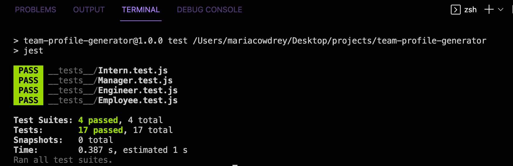

#Team Profile Generator

## Description 
A Node CLI application that generates a team profile based on user input. The profile displays information for three types of employees: manager, engineer and intern. It uses the Inquirer package to prompt questions in the command line.

  
## Installation
* To generate your own profile, `git clone` this project
* Run `npm install` in order to install the npm package dependencies as specified in the `package.json`
* Start the application by running `node index.js` in the command line
* Answer the prompts in your command line to generate the team profile
* After answering all the prompts, your team profile will be named 'team.html' and will be ready for you in the `dist` folder

## Tests
To run tests run `npm run test` in the command line.

## Usage 
Watch the demo video:

[Link to video](https://drive.google.com/file/d/1ccNYS7UV731fr3ig62nGprOaek5QDMKF/view)

## License
ISC

 